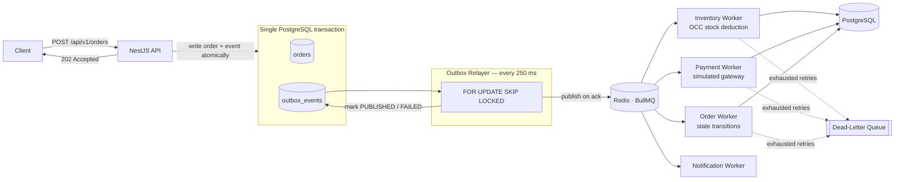
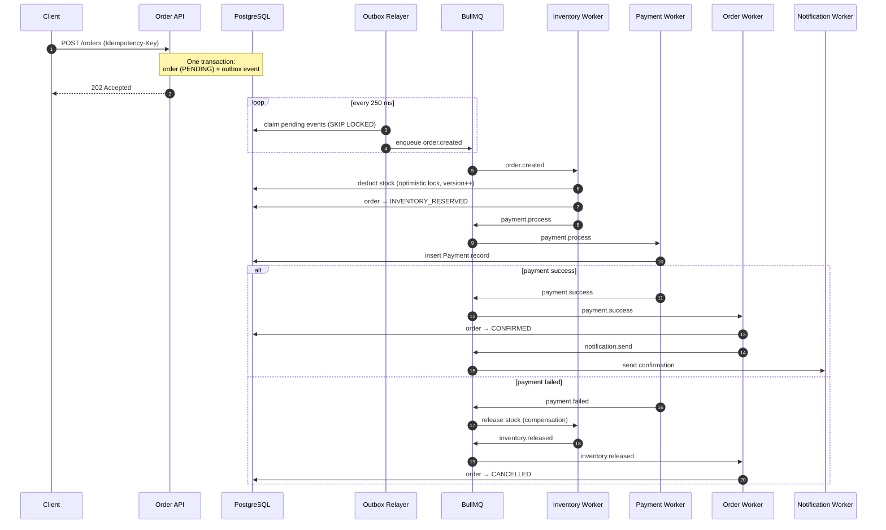

<h1 align="center">Event-Driven Order System</h1>

<p align="center">
  A production-grade <strong>event-driven e-commerce order backend</strong> built with NestJS, PostgreSQL, and Redis — featuring a transactional outbox, a choreographed order saga, idempotent APIs, and full-stack observability.
</p>

<p align="center">
  <a href="#-architecture"></a>
  
  
  
  
  
  
  
</p>

---

## Overview

This service accepts orders over HTTP and fulfills them through an **asynchronous, multi-step workflow** (inventory reservation → payment → confirmation → notification) coordinated entirely via **events on Redis/BullMQ** — with no blocking calls in the request path and no distributed transactions.

Instead of exposing the classic synchronous `POST /orders → 200 OK` contract, the API returns `202 Accepted` immediately and processes the order in the background. Consistency is achieved without distributed transactions by combining:

- **Transactional Outbox** — the order row and its `order.created` event are committed in a _single_ PostgreSQL transaction, so state changes and events can never diverge.
- **Choreographed Saga** — each worker reacts to events and emits the next step; failures trigger **compensating actions** (stock release, order cancellation) instead of 2PC.

## ✨ Key Engineering Highlights

| Concern                        | Implementation                                                                                                                                                                                      |
| ------------------------------ | --------------------------------------------------------------------------------------------------------------------------------------------------------------------------------------------------- |
| **Atomic event publication**   | Transactional Outbox: order + event persisted atomically; a polling relayer (`250ms`, batch of 50) publishes to BullMQ using `SELECT … FOR UPDATE SKIP LOCKED` — safe for multiple relayer replicas |
| **Distributed workflow**       | Choreography-based saga across 4 workers (`inventory`, `payment`, `order`, `notification`) with compensating transactions on failure                                                                |
| **HTTP idempotency**           | `Idempotency-Key` header → response cached in Postgres and replayed; Redis `SET NX EX` lock rejects concurrent duplicates with `409 Conflict`                                                       |
| **Exactly-once event effects** | Consumer-side deduplication: workers record processed event IDs _in the same transaction_ as the state change (unique-constraint check), plus deterministic BullMQ `jobId`s                         |
| **Concurrency control**        | Optimistic locking on stock (`version` column + conditional `UPDATE … WHERE version = n AND stock >= qty`) to prevent oversell under parallel requests                                              |
| **Failure handling**           | BullMQ retries with exponential backoff + jitter; exhausted jobs are parked in a **dead-letter queue** with full error context and a manual replay endpoint                                         |
| **End-to-end tracing**         | OpenTelemetry spans across HTTP → outbox → queue → workers, with **W3C `traceparent` propagated inside event envelopes** — one trace per saga across process boundaries                             |
| **Correlation IDs**            | Middleware-assigned `x-correlation-id` threaded through logs, spans, and every event's metadata (`correlationId` + `causationId`)                                                                   |
| **Metrics & dashboards**       | Prometheus metrics (saga duration, order counts, outbox latency), Grafana dashboards, Jaeger UI, and a Bull Board queue dashboard                                                                   |
| **Type-safe persistence**      | Prisma 7 with the `@prisma/adapter-pg` driver adapter                                                                                                                                               |
| **Production-ready Docker**    | 6-stage multi-stage build (non-root runner, separate one-shot `migrator` stage), healthchecks, and dependency gating in Compose                                                                     |

## 🏗 Architecture



### The order saga



**Order lifecycle:** `PENDING → INVENTORY_RESERVED → CONFIRMED`, with `CANCELLED` as the compensating terminal state.
**Failure hook for demos/tests:** any order placed with `customerId = "fail_payment"` forces the payment to decline, exercising the full compensation path.

## 📡 API

Base URL: `http://localhost:3000/api/v1`

| Method | Endpoint                   | Description                                                                           |
| ------ | -------------------------- | ------------------------------------------------------------------------------------- |
| `POST` | `/orders`                  | Create an order (`202 Accepted`, async processing). Supports `Idempotency-Key` header |
| `GET`  | `/orders/:id`              | Fetch an order with its items and product details                                     |
| `GET`  | `/health`                  | Liveness + dependencies (PostgreSQL `SELECT 1`, Redis `PING`)                         |
| `GET`  | `/metrics`                 | Prometheus metrics endpoint                                                           |
| `GET`  | `/admin/queues`            | Bull Board dashboard (all 5 queues)                                                   |
| `GET`  | `/admin/dlq/jobs`          | List parked dead-letter jobs                                                          |
| `POST` | `/admin/dlq/replay/:jobId` | Replay a failed job back to its original queue                                        |

### Example

```bash
# 1. Seed a product
docker compose exec postgres psql -U postgres -d order_system_db -c \
  "INSERT INTO products (id, sku, name, price, stock, updated_at)
   VALUES (gen_random_uuid(), 'SKU-001', 'Mechanical Keyboard', 129.99, 100, NOW())
   RETURNING id;"

# 2. Place an order (capture the productId from above)
curl -X POST http://localhost:3000/api/v1/orders \
  -H "Content-Type: application/json" \
  -H "Idempotency-Key: 7c9e6679-7425-40de-944b-e07fc1f90ae7" \
  -d '{
    "customerId": "customer-123",
    "items": [{ "productId": "<product-uuid>", "quantity": 2 }]
  }'

# 3. Watch the saga finish
curl http://localhost:3000/api/v1/orders/<order-id>
```

## 🛠 Tech Stack

| Layer               | Technology                                                                        |
| ------------------- | --------------------------------------------------------------------------------- |
| Runtime / Framework | Node.js 24 · NestJS 11 · TypeScript (ESM)                                         |
| Database            | PostgreSQL 16 · Prisma 7 (driver adapter `@prisma/adapter-pg`)                    |
| Messaging           | Redis 7 · BullMQ (5 queues)                                                       |
| Validation          | class-validator / class-transformer (global `ValidationPipe`, whitelist + forbid) |
| Observability       | OpenTelemetry (Jaeger) · Prometheus + Grafana · pino structured logging           |
| Job tooling         | Bull Board dashboard · custom DLQ admin API                                       |
| Testing             | Jest — unit, integration, and e2e suites                                          |
| Infrastructure      | Docker (multi-stage) · Docker Compose                                             |

## 🚀 Getting Started

### Prerequisites

- [Docker](https://docs.docker.com/get-docker/) and Docker Compose (recommended)
- or Node.js ≥ 22 with PostgreSQL 16 + Redis 7 for local development

### Quick start (one command)

```bash
docker compose up --build
```

This starts the full stack — PostgreSQL, Redis, Jaeger, Prometheus, Grafana, an automatic Prisma migration step, and the app (which only boots after migrations succeed and dependencies pass their healthchecks).

| Service                             | URL                                       |
| ----------------------------------- | ----------------------------------------- |
| API                                 | http://localhost:3000/api/v1              |
| Jaeger UI (traces)                  | http://localhost:16686                    |
| Prometheus                          | http://localhost:9090                     |
| Grafana (logins: `admin` / `admin`) | http://localhost:3001                     |
| Bull Board (queues)                 | http://localhost:3000/api/v1/admin/queues |
| Health check                        | http://localhost:3000/api/v1/health       |

### Local development

```bash
# 1. Install dependencies
npm install

# 2. Start infrastructure only
docker compose up postgres redis jaeger prometheus grafana -d

# 3. Configure environment
cp .env.example .env

# 4. Apply database migrations
npx prisma migrate deploy

# 5. Run in watch mode
npm run start:dev
```

## ⚙️ Configuration

All settings are provided via environment variables (see `.env.example`):

| Variable                                       | Description                           | Default                            |
| ---------------------------------------------- | ------------------------------------- | ---------------------------------- |
| `PORT`                                         | HTTP port                             | `3000`                             |
| `API_PREFIX`                                   | Global route prefix                   | `api/v1`                           |
| `DATABASE_URL`                                 | PostgreSQL connection string          | —                                  |
| `REDIS_HOST` / `REDIS_PORT` / `REDIS_PASSWORD` | Redis connection for BullMQ           | `localhost` / `6379` / —           |
| `OTEL_ENABLED`                                 | Enable OpenTelemetry tracing          | `true`                             |
| `OTEL_SERVICE_NAME`                            | Service name reported to the tracer   | `event-driven-order-system`        |
| `OTEL_EXPORTER_OTLP_ENDPOINT`                  | OTLP HTTP endpoint (Jaeger collector) | `http://localhost:14318/v1/traces` |

## 🧪 Testing

```bash
npm run test              # unit tests
npm run test:integration  # outbox relayer + consumer deduplication (real Postgres)
npm run test:e2e          # full saga flow
npm run test:cov          # coverage report
npx tsx scripts/test-occ.ts  # optimistic-locking concurrency demo
```

The integration suite validates the guarantees that matter most in this design: the outbox relayer publishes each event exactly once under concurrency, and consumers never double-process an event — even on redelivery.

## 📊 Observability

- **Tracing (Jaeger):** one end-to-end trace per order. The API, outbox relayer, and every worker create spans with `messaging.*` semantic conventions; producers inject W3C `traceparent` into event metadata so consumer spans continue the producer's trace across the queue boundary.
- **Metrics (Prometheus):** `orders_total{status}`, `saga_duration_seconds{result}`, `inventory_reserve_duration_seconds{result}`, `payment_duration_seconds{result}`, `outbox_relay_latency_seconds{result}`, plus default runtime metrics — all scrapable at `/metrics`.
- **Logging (pino):** structured JSON in production, pretty-printed in development; every log line carries the request's correlation ID.
- **Queues (Bull Board):** inspect job states, retries, and backoff in real time.

## 📁 Project Structure

```
src/
├── common/
│   ├── deduplication/     # consumer-side exactly-once processing (processed_events)
│   ├── events/            # queue names, event types, typed event payloads & envelopes
│   ├── interceptors/      # HTTP idempotency (Idempotency-Key)
│   ├── middleware/        # correlation-id propagation
│   └── tracing/           # span helpers with cross-queue trace continuation
├── core/database/         # Prisma service (pg driver adapter)
├── modules/
│   ├── order/             # REST API, DTOs, order state transitions
│   ├── outbox/            # transactional outbox + polling relayer (SKIP LOCKED)
│   ├── inventory/         # stock reservation with OCC + compensation release
│   ├── payment/           # simulated payment gateway worker
│   ├── notification/      # saga terminal step
│   ├── dlq/               # dead-letter queue inspection & replay
│   ├── health/            # dependency health checks
│   └── admin/             # Bull Board dashboard
├── otel.ts                # OpenTelemetry NodeSDK (http, express, pg, ioredis, prisma, pino)
└── main.ts                # bootstrap: validation, logging, global prefix
```

## 👤 Author

**Javad Hashemi** — [GitHub](https://github.com/javadhashemi-dev)

## 📄 License

Released under the [MIT License](LICENSE).
